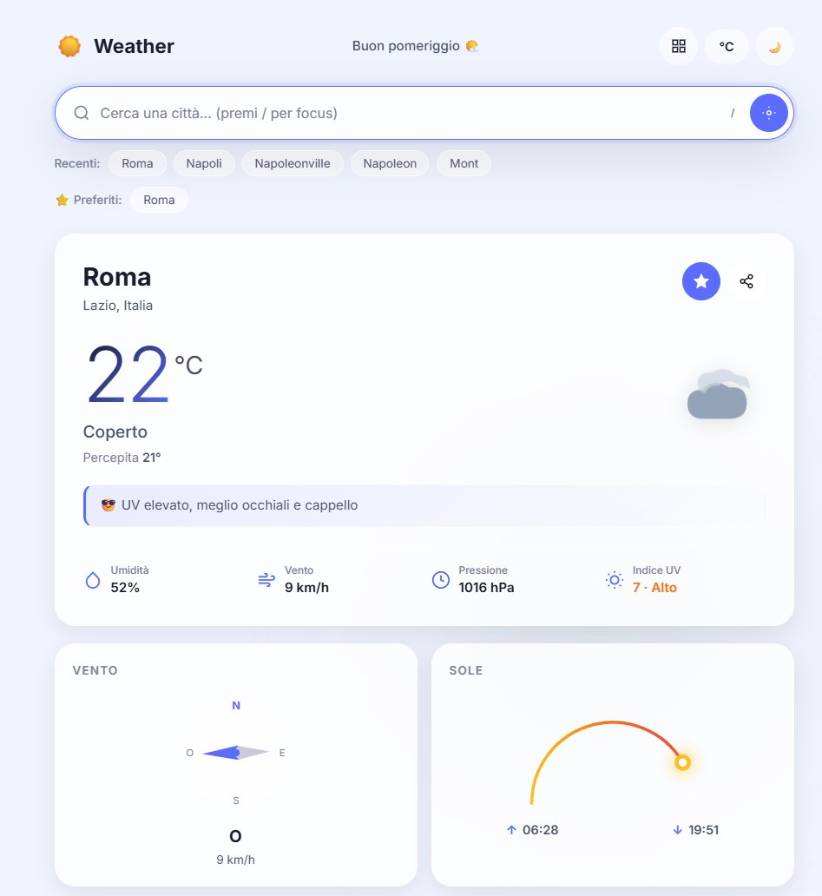
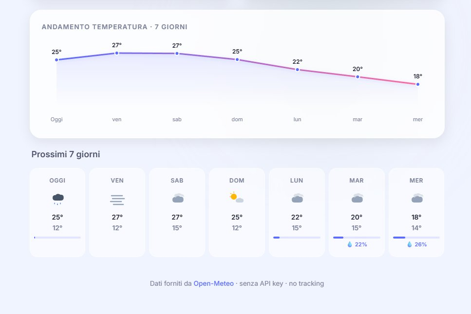
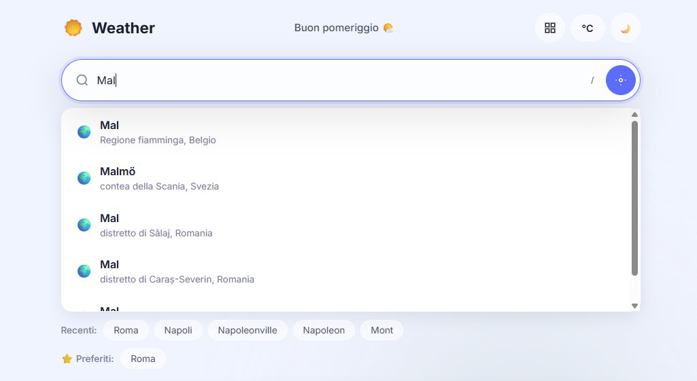
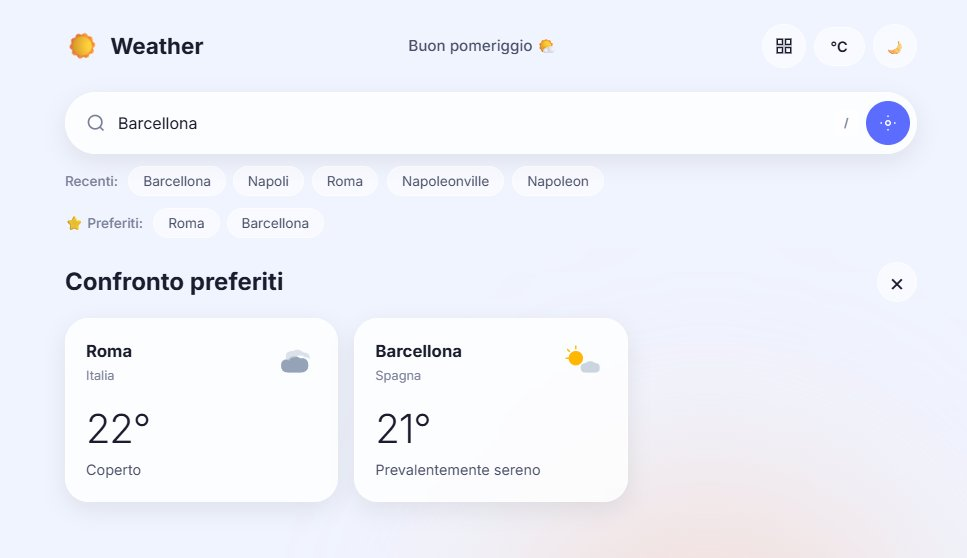
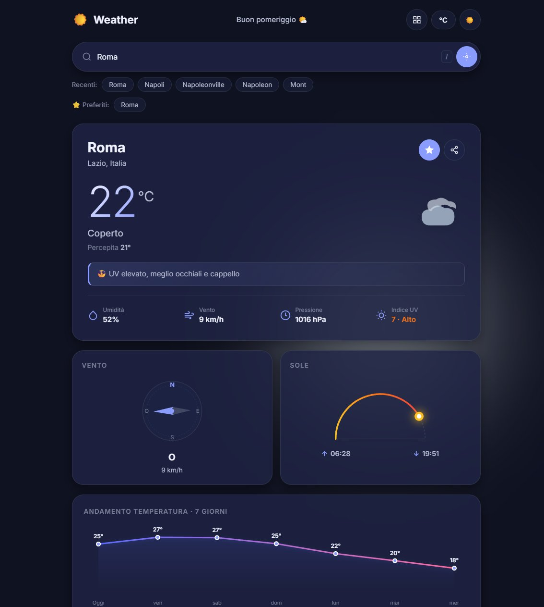

# 🌤️ Weather App

App meteo full-stack moderna, costruita con **Spring Boot** e **vanilla JavaScript**,
che utilizza le API gratuite di [Open-Meteo](https://open-meteo.com/) (nessuna API key richiesta).


---

## 📋 Panoramica

Un'applicazione meteo end-to-end pensata come **progetto didattico di riferimento** per imparare
come si costruisce un backend Spring Boot serio (cache, retry, validation, exception handling
centralizzata) accoppiato a un frontend moderno **senza framework**, curato nei dettagli di UX
e accessibilità.

**Target:** sviluppatori Java/full-stack che vogliono un esempio concreto e leggibile, con
codice commentato in italiano, di come si strutturano:

- Un client HTTP resiliente verso API esterne
- Una API REST validata e ben tipizzata
- Un frontend performante e accessibile senza build tool
- Una suite di test che copre casi limite e scenari realistici

---

## 📸 Screenshot

### Light Mode


### Previsioni a 7 giorni


### Autocomplete


### Confronto preferiti


### Dark Mode


---

## ✨ Funzionalità

### Backend
- **Meteo per città** — ricerca testuale con geocoding automatico
- **Meteo per coordinate** — usato dalla geolocalizzazione
- **Autocomplete** — suggerimenti città durante la digitazione
- **Previsioni a 7 giorni** con temperature min/max, probabilità pioggia, indice UV
- **Cache multi-livello con Caffeine** — TTL differenziati per geocoding (24h), meteo (10min), forecast (30min)
- **Retry automatico** con backoff esponenziale sugli errori transitori (timeout, rete)
- **Validation rigorosa** — `@NotBlank`, `@Pattern` Unicode-aware, `@DecimalMin/Max`
- **Gestione errori centralizzata** — messaggi utente chiari, HTTP status appropriati
- **Timeout configurabile** su connect/read/write

### Frontend
- **Ricerca con autocomplete** — debounce, navigazione tastiera (↑↓ Enter Esc)
- **Geolocalizzazione** — usa posizione del device con fallback graceful
- **Preferiti e cronologia** — salvati in `localStorage`, max 10 preferiti e 5 cronologia
- **Modalità confronto** — confronta fino a 10 città preferite affiancate
- **Grafico temperature** SVG puro per la settimana
- **Bussola vento animata** con direzione e intensità
- **Arco sole** con posizione corrente, alba e tramonto
- **Particelle animate** (pioggia, neve, stelle) su canvas, DPR-aware
- **Dettaglio giorno** in modale con focus trap
- **Dark mode** con persistenza delle preferenze
- **Cambio unità** °C/km/h ↔ °F/mph
- **URL condivisibile** — la città corrente viene salvata come query param
- **Share nativo** (Web Share API) con fallback a copia link
- **Scorciatoie tastiera** — `/` per focus ricerca, `Esc` per chiudere modali/confronto

### Accessibilità e sicurezza
- **Content Security Policy** restrittiva
- **ARIA live regions** sui banner per screen reader
- **Focus management** nei modali (save/restore)
- **`prefers-reduced-motion`** rispettato (niente animazioni se l'OS le vuole ridotte)

---

## 🛠️ Tech Stack

| Layer | Tecnologia |
|---|---|
| Runtime | Java 17 |
| Framework | Spring Boot 3.4.5 |
| HTTP Client | Spring WebClient (reactive) |
| Cache | Caffeine (in-memory) |
| Validation | Jakarta Bean Validation |
| Test | JUnit 5, Mockito, MockMvc, `@WebMvcTest` |
| Build | Maven |
| Frontend | HTML5 + CSS3 + JavaScript ES2022 (zero dipendenze) |
| Font | Inter (via Google Fonts) |
| API meteo | [Open-Meteo](https://open-meteo.com/) |

---

## 📦 Requisiti

- **JDK 17+** (testato con OpenJDK 17)
- **Maven 3.8+**
- Connessione Internet (per chiamare Open-Meteo)
- Un browser moderno (Chrome 105+, Firefox 121+, Safari 15.4+) per supporto completo di `:has()` e Web Share API

---

## 🚀 Installazione

```bash
# Clona il repository
git clone https://github.com/ClickCreateRB/weather-app.git
cd weather-app

# Compila e scarica le dipendenze
mvn clean install
```

Al primo `install` Maven scaricherà Spring Boot e le dipendenze (~60 MB).

---

## ⚙️ Configurazione

Tutte le configurazioni sono in `src/main/resources/application.yml`. Valori di default sensati,
ma modificabili:

```yaml
server:
  port: 8080                          # porta HTTP

openmeteo:
  forecast-url: https://api.open-meteo.com/v1/forecast
  geocoding-url: https://geocoding-api.open-meteo.com/v1/search
  timeout-seconds: 10                 # connect/read/write timeout

management:
  endpoints:
    web:
      exposure:
        include: health,info          # endpoint Actuator esposti
```

Per sovrascrivere un valore a runtime senza toccare il file:

```bash
mvn spring-boot:run -Dspring-boot.run.arguments="--server.port=9090"
```

---

## 🏃 Esecuzione

```bash
mvn spring-boot:run
```

Apri il browser su **[http://localhost:8080](http://localhost:8080)**.

Per un build packaged:

```bash
mvn clean package
java -jar target/weather-app-1.0.0-SNAPSHOT.jar
```

---

## 📚 API REST

### `GET /api/weather`

Recupera il meteo corrente e le previsioni per una città.

**Query parameters:**

| Nome | Tipo | Obbligatorio | Default | Validazione |
|---|---|---|---|---|
| `city` | string | sì | — | 2-100 caratteri, lettere Unicode + spazi/apostrofi/punti/trattini |
| `unit` | string | no | `celsius` | `celsius` \| `fahrenheit` |

**Esempio:**
```bash
curl "http://localhost:8080/api/weather?city=Roma&unit=celsius"
```

### `GET /api/weather/coords`

Recupera il meteo per coordinate geografiche (usato dalla geolocalizzazione).

| Nome | Tipo | Range |
|---|---|---|
| `lat` | double | -90.0 ↔ 90.0 |
| `lon` | double | -180.0 ↔ 180.0 |
| `unit` | string | `celsius` \| `fahrenheit` |

**Esempio:**
```bash
curl "http://localhost:8080/api/weather/coords?lat=41.89&lon=12.48"
```

### `GET /api/weather/autocomplete`

Restituisce fino a 5 città che matchano la query, utili per l'autocompletamento.

| Nome | Tipo | Validazione |
|---|---|---|
| `q` | string | 2-50 caratteri |

**Esempio:**
```bash
curl "http://localhost:8080/api/weather/autocomplete?q=Mil"
```

---

## 🎨 Output di esempio

### Risposta `/api/weather?city=Roma`

```json
{
  "city": "Roma",
  "country": "Italia",
  "countryCode": "IT",
  "admin1": "Lazio",
  "latitude": 41.89,
  "longitude": 12.48,
  "current": {
    "temperature": 22.5,
    "feelsLike": 21.0,
    "humidity": 65,
    "windSpeed": 12.3,
    "windDirection": 180,
    "pressure": 1013.0,
    "weatherCode": 0,
    "description": "Cielo sereno",
    "icon": "sunny",
    "isDay": true,
    "suggestion": "Giornata perfetta per una passeggiata"
  },
  "today": {
    "sunrise": "2026-04-16T06:30",
    "sunset": "2026-04-16T19:45",
    "uvIndex": 5.0
  },
  "forecast": [
    {
      "date": "2026-04-16",
      "temperatureMax": 24.0,
      "temperatureMin": 15.0,
      "weatherCode": 0,
      "description": "Cielo sereno",
      "icon": "sunny",
      "precipitationProbability": 10,
      "uvIndex": 5.0
    }
  ]
}
```

### Risposta di errore (400 Bad Request)

```json
{
  "error": "Il nome della città non è valido: sono ammesse lettere, spazi, apostrofi, punti e trattini (min 2 caratteri)",
  "status": 400,
  "timestamp": "2026-04-16T14:32:11.123"
}
```

### Mapping HTTP status codes

| Status | Scenario |
|---|---|
| `200 OK` | Richiesta riuscita |
| `400 Bad Request` | Validation fallita, parametro mancante o tipo errato |
| `404 Not Found` | Città non trovata dal geocoding |
| `502 Bad Gateway` | API Open-Meteo irraggiungibile o lenta (dopo 3 tentativi) |
| `500 Internal Server Error` | Eccezione non gestita (fallback) |

---

## 💻 Guida all'uso (Frontend)

1. **Cerca una città** digitando nel campo — dopo 2 caratteri appare l'autocomplete
2. **Naviga con la tastiera** ↑↓ tra i suggerimenti, `Enter` per selezionare, `Esc` per chiudere
3. Premi `/` in qualsiasi momento per mettere focus sulla ricerca
4. **Geolocalizzazione** — clicca il bottone a forma di mirino per usare la tua posizione (richiede permesso del browser)
5. **Preferiti** ⭐ — clicca la stella per salvare la città corrente (massimo 10)
6. **Confronto** ⊞ — confronta fino a 10 preferiti affiancati (richiede almeno 2)
7. **Cambio unità** — clicca `°C`/`°F` nell'header
8. **Dark mode** — clicca l'icona 🌙/☀️ nell'header
9. **Dettaglio giorno** — clicca una card nella previsione a 7 giorni
10. **Condividi** — clicca l'icona share (usa Web Share API su mobile, copia link su desktop)

---

## 🏗️ Architettura

```
┌─────────────┐   HTTPS    ┌────────────────┐   HTTPS    ┌──────────────┐
│   Browser   │ ─────────► │  Spring Boot   │ ─────────► │  Open-Meteo  │
│  (frontend) │            │   (backend)    │            │   (API)      │
└─────────────┘            └────────────────┘            └──────────────┘
                                   │
                                   │
                            ┌──────▼──────┐
                            │  Caffeine   │
                            │   Cache     │
                            └─────────────┘
```

### Responsabilità dei layer

- **`controller/`** — endpoint REST. Solo validation di input + delega al service. Nessuna logica di business.
- **`service/`** — logica di business: composizione di più chiamate, trasformazioni, regole di dominio.
- **`client/`** — unica porta verso l'esterno. Retry, timeout, cache, mapping delle eccezioni tecniche in eccezioni di dominio.
- **`model/`** — DTO per request/response. Separati tra quelli di Open-Meteo e quelli esposti all'utente (niente leak di schema esterno).
- **`exception/`** — `GlobalExceptionHandler` traduce eccezioni in risposte HTTP coerenti.
- **`config/`** — bean Spring: WebClient, CacheManager Caffeine.

### Flusso tipico di una richiesta

```
GET /api/weather?city=Roma
  → WeatherController.getByCity() [valida input]
    → WeatherService.getWeatherByCity("Roma", "celsius")
      → GeocodingService.resolve("Roma") [cache 24h]
        → OpenMeteoClient.geocode("Roma") [retry, timeout]
      → OpenMeteoClient.fetchForecast(lat, lon, unit) [cache 30min]
      → mapping a WeatherInfo [DTO utente]
    ← WeatherInfo
  ← 200 OK + JSON
```

---

## 🧪 Testing

```bash
mvn test
```

**Coverage attuale: 31 test, tutti passing.**

| Test class | Count | Focus |
|---|---:|---|
| `WeatherControllerTest` | 4 | Happy path endpoint + 404 + param mancante |
| `WeatherControllerValidationTest` | 13 | Vincoli input: @Pattern, @Size, @DecimalMin, type mismatch, errori 502 |
| `WeatherServiceTest` | 5 | Logica di composizione + propagazione eccezioni |
| `GeocodingServiceTest` | 9 | Casi limite: null/empty results, query corte, whitespace, mapping |

Nota: `WeatherControllerValidationTest` usa `@WebMvcTest` + `@MockitoBean` (non il deprecato
`@MockBean`) per caricare l'AOP di `@Validated`, che in standalone non sarebbe attivo.

---

## 🔒 Sicurezza

- **Content Security Policy** con `default-src 'self'` e whitelist esplicita per Google Fonts
- **Bean Validation** sul nome città con pattern Unicode-aware che rifiuta caratteri pericolosi
  (`<`, `>`, simboli) e accetta città con apostrofi e accenti (`L'Aquila`, `São Paulo`)
- **Output encoding** sul frontend: ogni valore da API passa per `textContent` o
  `escapeHtml()` prima di essere inserito nel DOM
- **localStorage** con try/catch (Safari private mode, quota piena, storage disabilitato)
- **Rate limiting implicito** tramite cache Caffeine — le query ripetute non generano traffico
- **Retry mirato** — solo errori transitori, mai su 4xx/5xx per non sprecare quota API

---

## ♿ Accessibilità (WCAG 2.1)

- `role="dialog"` + `aria-modal="true"` sui modali
- `aria-live="polite"` / `"assertive"` sui banner
- `aria-selected` sincronizzato sugli item autocomplete durante navigazione tastiera
- `aria-label` su tutti i bottoni senza testo visibile
- Focus management nei modali: salvato e restituito alla chiusura
- `prefers-reduced-motion` disabilita animazioni CSS e particelle canvas
- Canvas DPR-aware: niente sfocatura su display Retina

---

## 🗂️ Struttura del progetto

```
weather-app/
├── pom.xml
├── README.md
└── src/
    ├── main/
    │   ├── java/com/weatherapp/
    │   │   ├── WeatherApplication.java
    │   │   ├── client/
    │   │   │   └── OpenMeteoClient.java
    │   │   ├── config/
    │   │   │   ├── AppConfig.java          # WebClient + timeout
    │   │   │   └── CacheConfig.java        # Caffeine cache manager
    │   │   ├── controller/
    │   │   │   └── WeatherController.java
    │   │   ├── exception/
    │   │   │   ├── CityNotFoundException.java
    │   │   │   ├── ExternalApiException.java
    │   │   │   └── GlobalExceptionHandler.java
    │   │   ├── model/
    │   │   │   ├── AutocompleteResult.java
    │   │   │   ├── GeocodingResponse.java  # schema Open-Meteo
    │   │   │   ├── WeatherResponse.java    # schema Open-Meteo
    │   │   │   └── WeatherInfo.java        # DTO esposto all'utente
    │   │   └── service/
    │   │       ├── GeocodingService.java
    │   │       ├── WeatherCodeMapper.java  # codici WMO → descrizione/icona
    │   │       └── WeatherService.java
    │   └── resources/
    │       ├── application.yml
    │       └── static/
    │           ├── index.html
    │           ├── app.js
    │           ├── style.css
    │           └── favicon.svg
    └── test/
        └── java/com/weatherapp/
            ├── controller/
            │   ├── WeatherControllerTest.java
            │   └── WeatherControllerValidationTest.java
            └── service/
                ├── GeocodingServiceTest.java
                └── WeatherServiceTest.java
```

---

## 🔮 Miglioramenti futuri

### Priorità alta
- **Service Worker + Web App Manifest** per installabilità PWA e uso offline
- **Circuit breaker** con Resilience4j oltre al retry, per non bombardare un'API chiaramente giù
- **Observability** — Micrometer + endpoint `/actuator/metrics` esposto, integrazione Prometheus

### Priorità media
- **i18n** — attualmente tutto hardcoded italiano. Estrazione in `messages_xx.properties`
- **Dark mode automatica** da `prefers-color-scheme` come default se l'utente non ha mai scelto
- **Navigazione browser bidirezionale** — sostituire `history.replaceState` con `pushState` + listener `popstate`
- **Storico dati storici** — integrazione con [Open-Meteo Historical Weather API](https://open-meteo.com/en/docs/historical-weather-api)
- **Notifiche push** per avvisi meteo estremi (Web Push API)

### Priorità bassa
- **Testing frontend** — introdurre Vitest o Playwright per test di UI e E2E
- **Compressione response** — `server.compression.enabled=true` per ridurre banda su mobile
- **Cache distribuita** — se l'app scalasse orizzontalmente, Redis invece di Caffeine in-memory
- **API key opzionale** per il tier Open-Meteo Commercial (maggiore quota)

---

## 🐞 Segnalazione bug

Se trovi un bug o hai un'idea di miglioramento, apri una issue descrivendo:
- Cosa hai fatto per riprodurre il problema
- Cosa ti aspettavi
- Cosa è successo invece
- Browser e versione (per bug frontend) o log backend (per bug server)

---

## 📄 Licenza

MIT — libero uso, modifica e distribuzione con attribuzione.

---

## 🙏 Ringraziamenti

- [Open-Meteo](https://open-meteo.com/) per l'API meteo gratuita e senza registrazione
- [Inter](https://rsms.me/inter/) di Rasmus Andersson, un font straordinario per UI
- La community Spring Boot per la documentazione impeccabile
